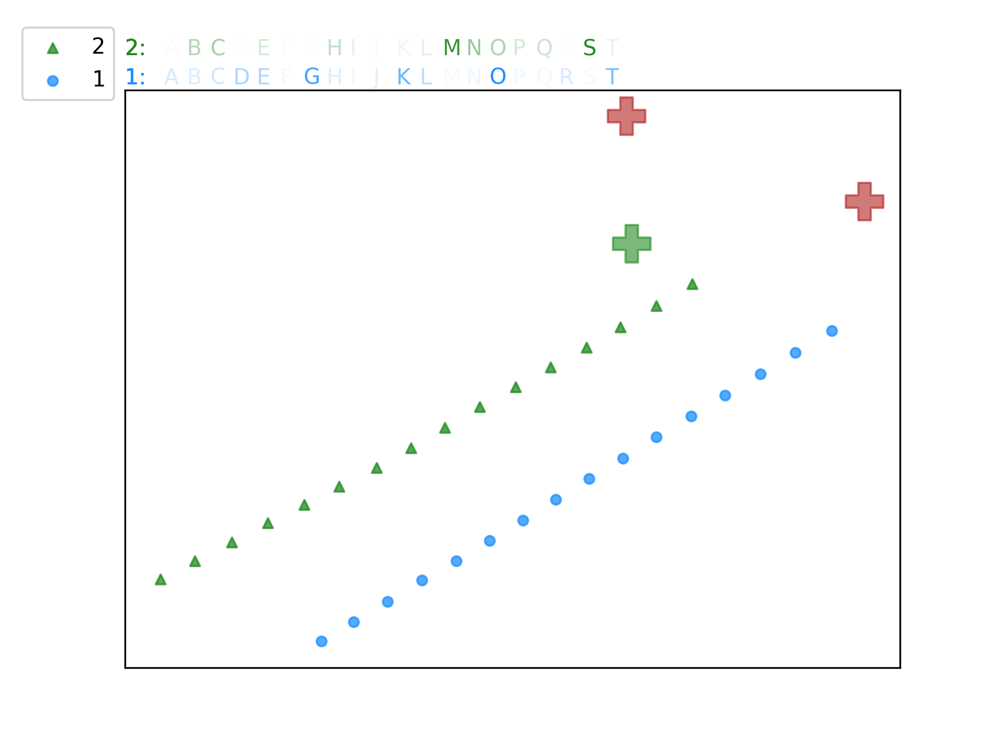
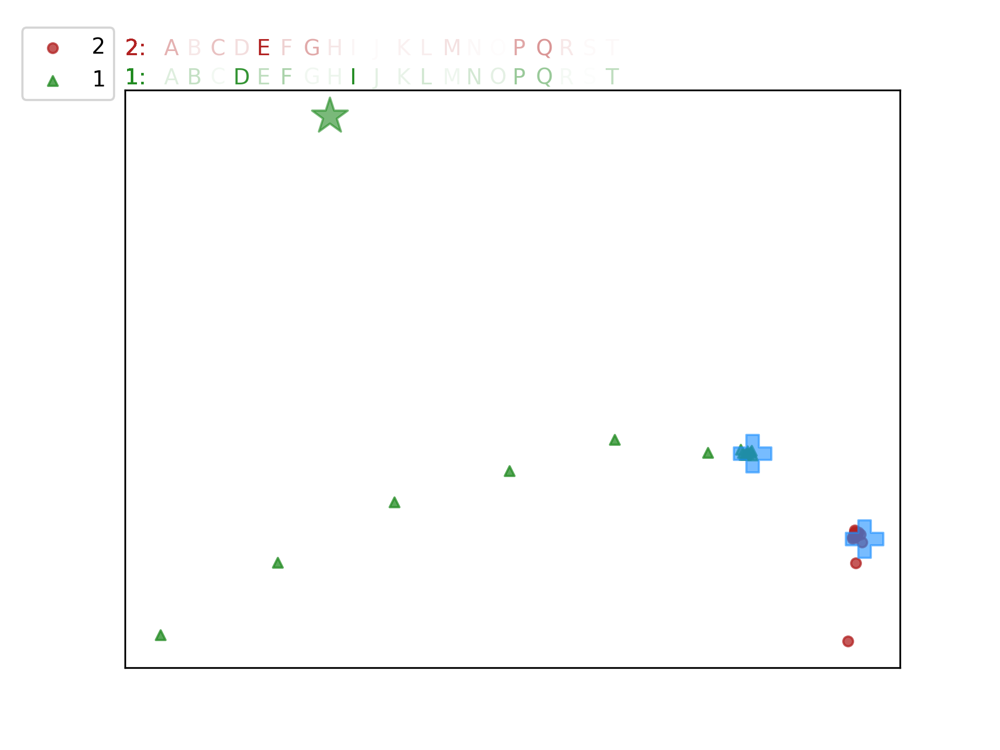
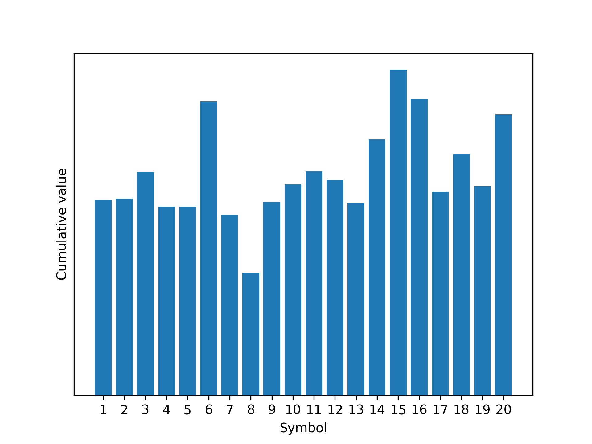
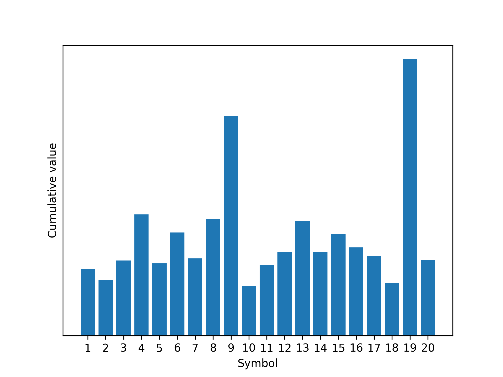
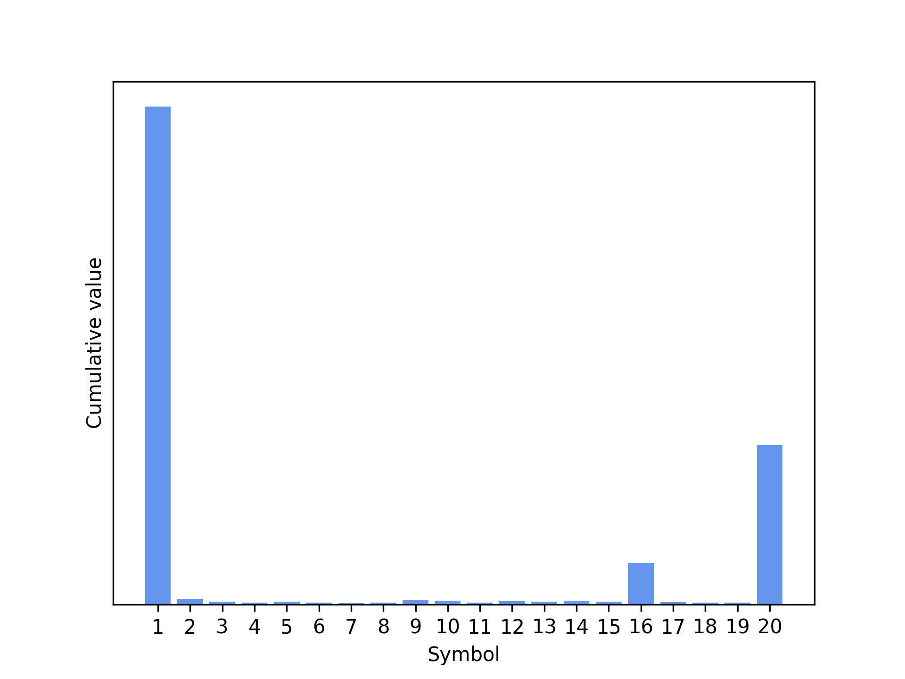

Emergent Language  
--- 
Given code is a fork of an official partial implementation of the [Emergence of Grounded Compositional Language in Multi-Agent Populations](https://arxiv.org/pdf/1703.04908.pdf) paper.  The original version is presented in [this](https://github.com/bkgoksel/emergent-language) repo.  
  
**Project report PDF file** can be found [here](docs/Emergent_Language_report.pdf).  

## Installation
(to be executed in the repo directory)  
```
virtualenv -p python3 .venv
source .venv/Scripts/activate # for Windows
soruce .venv/bin/activate # for Linux
pip install -r requirements.txt
```
  
## Outline
The following code is able to run training experiments with user-defined parameter ranges and produce various visualizations. This implementation advances from the original in the following:  
* fixed some bugs, annotated code  
* added experiments automation and visualizations  
* introduced entropy-based speech loss  

The introduced *entropy-based loss is shown to be more effective* than the original word-frequency-based loss.  

## Visualization
An example of the trajectory and symbol visualization is presented below.  

Not trained | Trained
:-------------------------:|:-------------------------:
 |   
  
## Results
The following table presents the distribution of symbol frequencies at the final training step:  

No word penalization | Word frequency loss | Entropy loss 
:-------------------------:|:-------------------------:|:-------------------------:
 |  |   

It can be observed that the entropy-based loss produces distributions that while being not singular do not contain background noise.

## Abstract
The multi-agent approach has shown to be an effective method of solving both the tasks that require cooperation, and that are classically considered to be individual. Speech and communication is often a necessary prerequisite to the effective cooperation. This work presents an evaluation of Mordatch & Abbeel (2017) paper that introduces agents to the 2D simulated physical environment that has a goal of reaching the given landmarks while utilizing communication to share the information about them. Contributions of this work include modifying the open-source implementation with visualization, automated experiments, and additional entropy-based losses. The default vocabulary frequency-based loss is shown to be marginally effective and the newly introduced entropy loss, while being unstable for not carefully selected normalization dimensions, consistently outperforms standard word penalization with the right choice of the entropy calculation method.  
  
## Running experiments
To run the experiments with desired parameters execute the `run_experiments.py` script. To modify the run parameters, change the `experiments` dictionary. It contains two fields, `default_kwargs` -- they will be passed during all the runs and `configurations` list that can be filled with the parameters you want to modify and the ranges that will be used. Examples are provided in the code.  
All the pictures yielded from the project experiments are available at the `./experiments` directory.  
